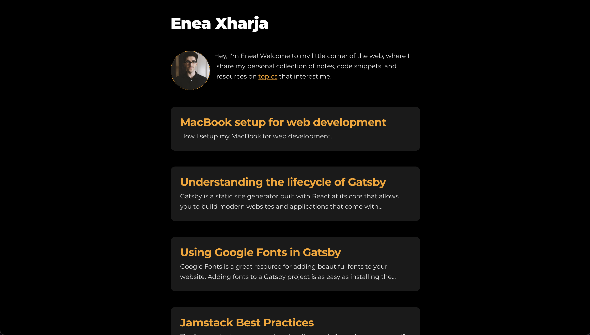

_A starter blog built with Gatsby_

## Features

- Gatsby 4
- React 18
- TypeScript
- styled-components
- Prettier
- Path Mapping
- Syntax highlighting for your Markdown docs

## Quick start

To run this project locally:

```shell
npm i
gatsby develop
```

## What's inside?

A quick look at the top-level files and directories you'll see in the project.

<!-- prettier-ignore -->
```markdown
.
├── src
    ├── components
    ├── data
    ├── images
    ├── pages
    ├── templates
    └── utils
├── static
├── .gitignore
├── .prettierignore
├── .prettierrc
├── gatsby-browser.tsx
├── gatsby-config.ts
├── gatsby-node.ts
├── package-lock.json
├── package.json
├── PULL_REQUEST_TEMPLATE.md
├── README.md
└── tsconfig.json
```

Code available on [GitHub](https://github.com/eneax/blog).
