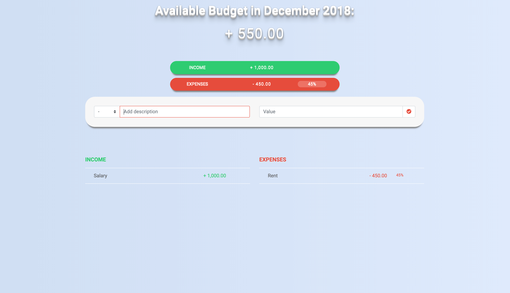

_budget app project_

Responsive Budget App built with Bootstrap 4 and Javascript.

### How it works

You can enter income and expenses in a given month.
The app will calculate and display the total amount of income and expenses.
It will also calculate the percentage of each expense on the total income.

Code available on [GitHub](https://github.com/eneax/budgetApp).
