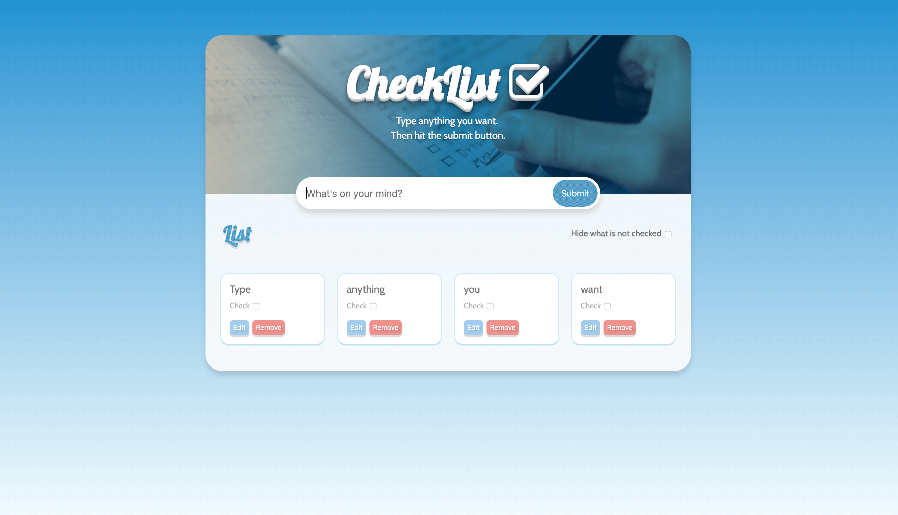

_CheckList project_

A basic checklist built with CSS and Javascript.

### How it works

Type anything you want, then hit the submit button.
A list will automatically be created.
You can edit and delete the text fields previously added.
You can also hide the elements that are not checked.

Code available on [GitHub](https://github.com/eneax/CheckList).
