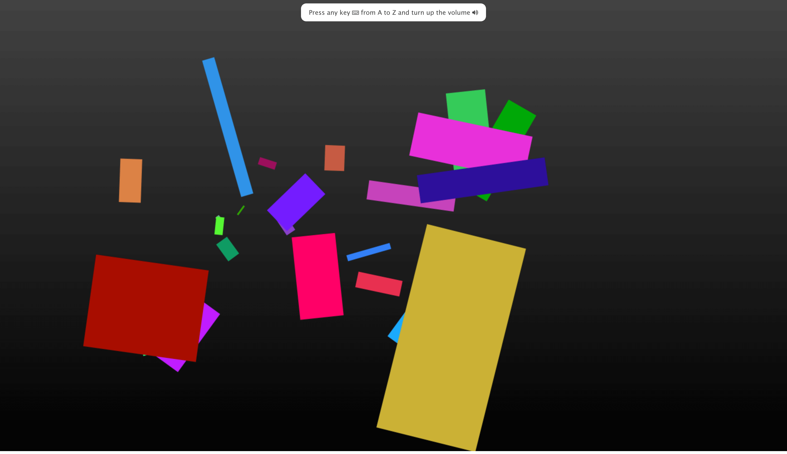

_confettiDJ project_

confettiDJ is an animation and sound game, created using Paper.js, howler.js and the sounds from the open source project Neuronal Synchrony.

### Play

Press any key, from A to Z, to create jingles and rotating confetti.

### Note

To get rid of the Cross Origin errors in the console, you'll need to run a local HTTP server from your project's directory, and load the confettiDJ.html file from there.

Code available on [GitHub](https://github.com/eneax/confettiDJ).
