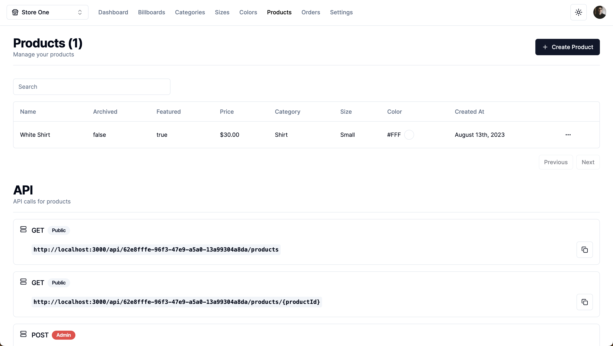
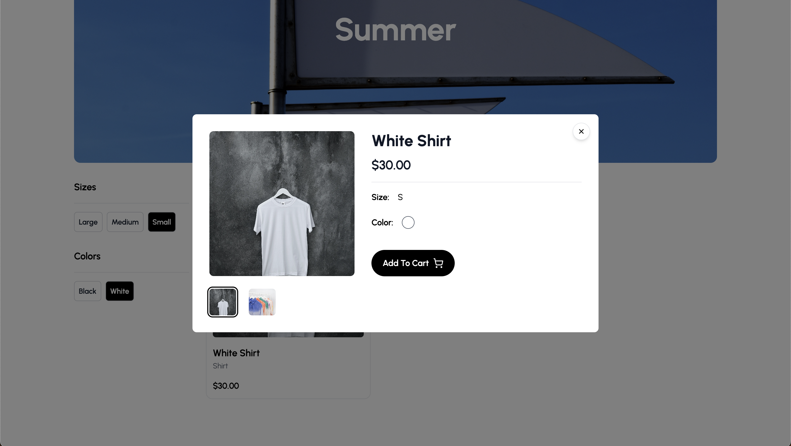

The e-commerce dashboard is a full stack application built using [Next.js](https://nextjs.org) with [React Server Components](https://vercel.com/blog/understanding-react-server-components), [Tailwind CSS](https://tailwindcss.com), [shadcn/ui](https://ui.shadcn.com), [Clerk](https://clerk.com), [Prisma](https://www.prisma.io), [PlanetScale](https://planetscale.com), [Cloudinary](https://cloudinary.com) and [Stripe](https://stripe.com).


_E-commerce Admin Dashboard built with Next.js_

## Environment Variables

Create a `.env` file in your root directory:

```
NEXT_PUBLIC_CLERK_PUBLISHABLE_KEY=
CLERK_SECRET_KEY=

NEXT_PUBLIC_CLERK_SIGN_IN_URL=
NEXT_PUBLIC_CLERK_SIGN_UP_URL=
NEXT_PUBLIC_CLERK_AFTER_SIGN_IN_URL=
NEXT_PUBLIC_CLERK_AFTER_SIGN_UP_URL=

DATABASE_URL=

NEXT_PUBLIC_CLOUDINARY_CLOUD_NAME=

STRIPE_SECRET_KEY=
STRIPE_SECRET_WEBHOOK=

FRONTEND_STORE_URL=
```

## Getting started with the dashboard

To run this project locally:

```bash
npm i

npx prisma db push

npm run dev
```

Open `http://localhost:3000` with your browser to see the result.

You can start editing the page by modifying `app/page.tsx`. The page auto-updates as you edit the file.

The code for the dashboard project is available on the [ecommerce-dashboard](https://github.com/eneax/ecommerce-dashboard) repository on GitHub.

## Getting started with the store

The e-commerce store is a full stack application built using [Next.js](https://nextjs.org) with [React Server Components](https://vercel.com/blog/understanding-react-server-components) and [Tailwind CSS](https://tailwindcss.com).


_E-commerce Store built with Next.js_

To run this project locally, you must first run the [ecommerce-dashboard](https://github.com/eneax/ecommerce-dashboard) project.

Create a `.env` file in your root directory with the following environment variables from the [ecommerce-dashboard](https://github.com/eneax/ecommerce-dashboard) project:

```js
NEXT_PUBLIC_API_URL=
NEXT_PUBLIC_BILLBOARD_ID=
```

Then, run the development server:

```bash
npm i

npm run dev
```

Open [http://localhost:3001](http://localhost:3001) with your browser to see the result.

You can start editing the page by modifying `app/page.tsx`. The page auto-updates as you edit the file.

The code for the store project is available on the [ecommerce-store](https://github.com/eneax/ecommerce-store) repository on GitHub.
