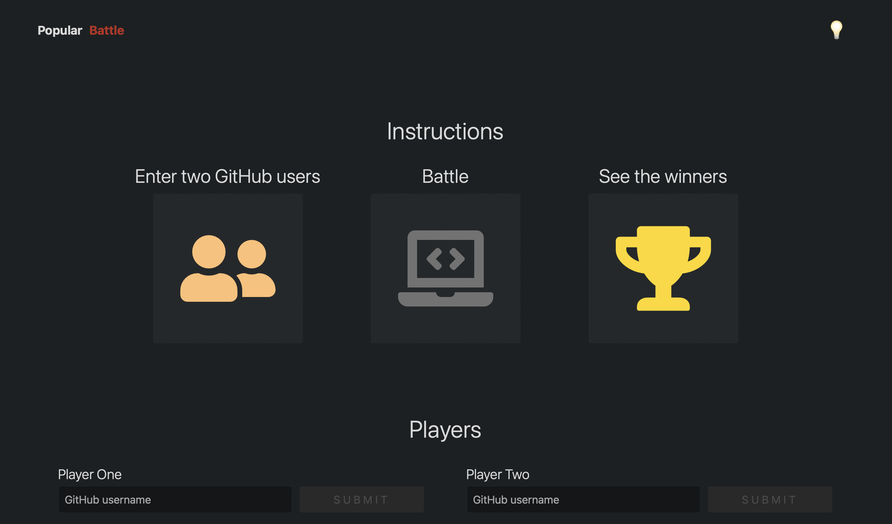

_GitHub Battle project_

React app built using [React](https://reactjs.org), [Webpack](https://webpack.js.org), [Babel](https://babeljs.io), and [Netlify](https://www.netlify.com).

You'll be able to discover the most popular repos for a variety of languages, as well as battle two GitHub users to see who has a better profile.

Code available on [GitHub](https://github.com/eneax/github-battle).
