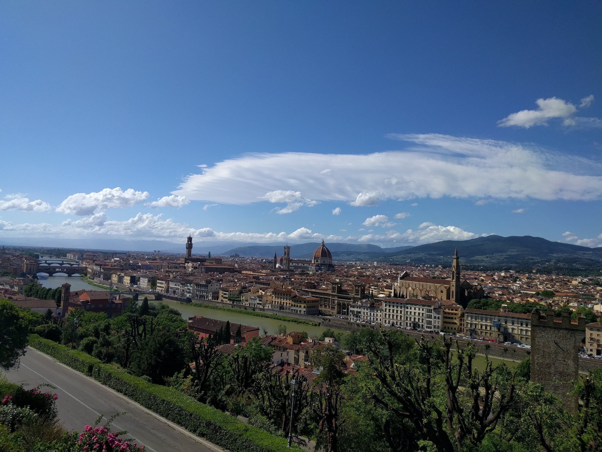

A collection of photos from my life in Tuscany.

_Arno River from Ponte Vecchio (Florence) - February 2019_

_Piazza Grande in Montepulciano - December 2018_

_In honor of Leonardo da Vinci (Montepulciano) - October 2018_

_Cortona - October 2018_

_Radda in Chianti - September 2018_

_Lake of Chiusi - July 2017_

_Montepulciano - April 2017_

_Siena Cathedral - January 2017_

_Arno River (Florence) - November 2016_

_Palazzo Vecchio (Florence) - November 2016_

_Siena - October 2016_

_Florence - May 2016_

_Giotto's Campanile (Florence) - October 2015_

_Leaning Tower of Pisa - January 2015_

_Piazza Salimbeni - December 2014_

_Lake of Chiusi - 2014_

_Piazza Del Campo - Siena 2014_

_San Domenico - Siena 2013_
