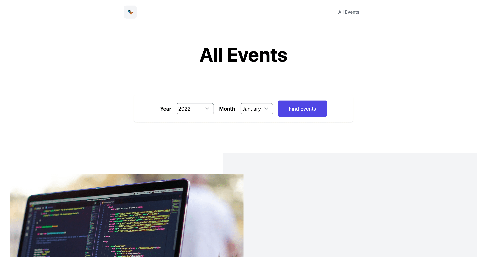

_Next.js Events project_

Fullstack application built with [Next.js](https://nextjs.org), [Tailwind CSS](https://tailwindcss.com), [Firebase](https://firebase.google.com), [MongoDB](https://www.mongodb.com) and deployed on [Vercel](https://vercel.com).

In this application, you'll be able to discover new events, filter them by date and add comments to them.

Code available on [GitHub](https://github.com/eneax/nextjs-events).
