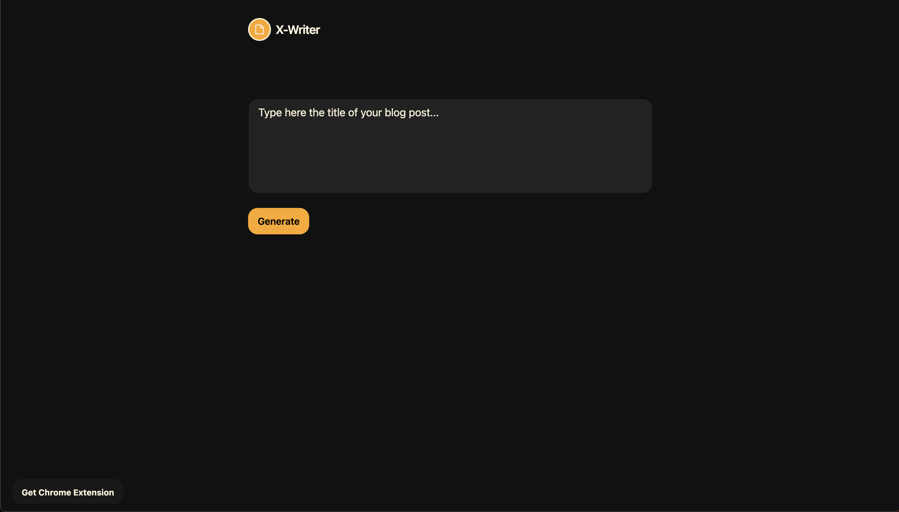

X-Writer is your own AI writing assistant that takes a title as input and generates a full blog post for you.


_AI writing assistant built with GPT-3 and OpenAI_

## Features

- Next.js 13
- React 18
- TypeScript 4
- Tailwind CSS 3
- Path Mapping (for absolute imports)
- GPT-3 and OpenAI

## Environment Variables

Create a `.env.local` file in your root directory with the [OpenAI API key](https://beta.openai.com/account/api-keys).

```
OPENAI_API_KEY
```

## Quick start

To run this project locally:

```shell
npm i
npm run dev
```

Code available on [GitHub](https://github.com/eneax/x-writer).
