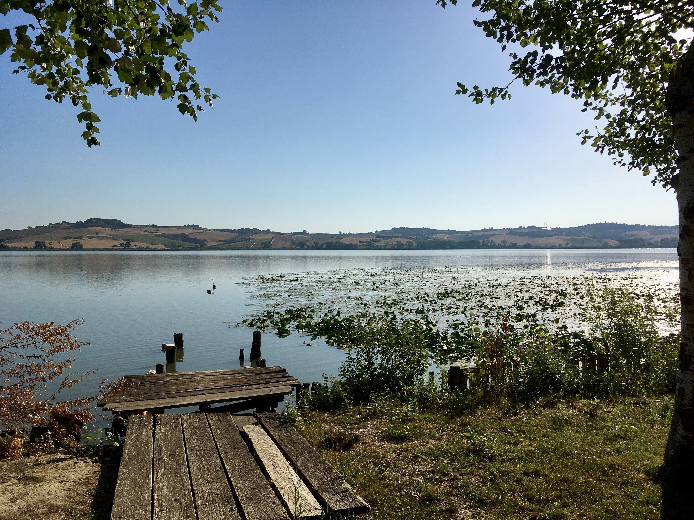
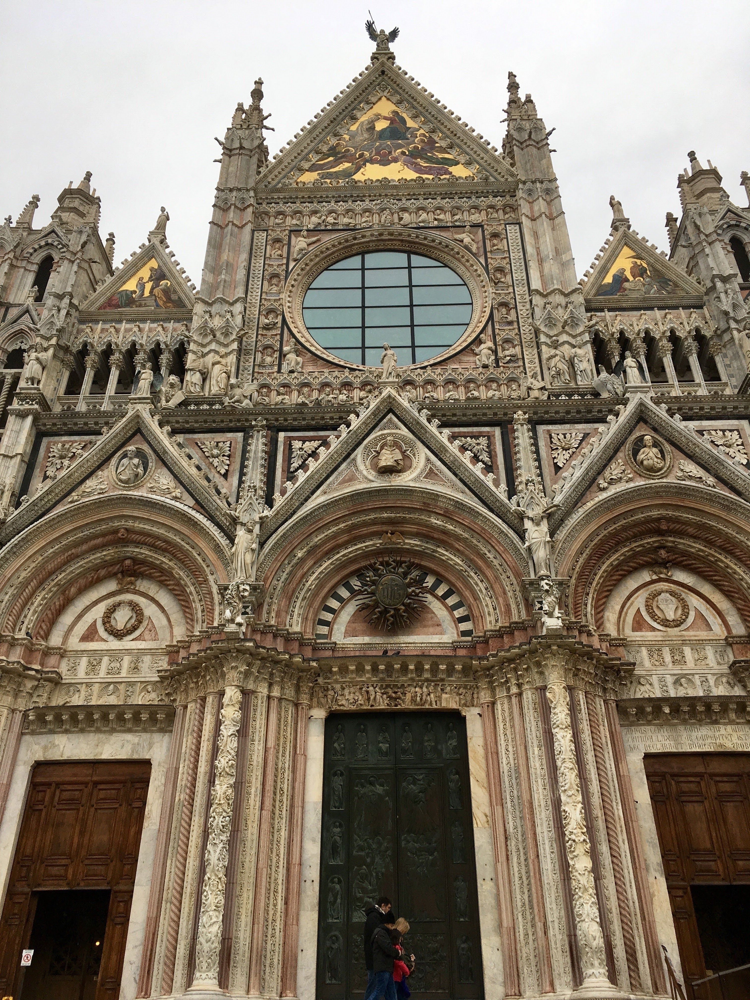
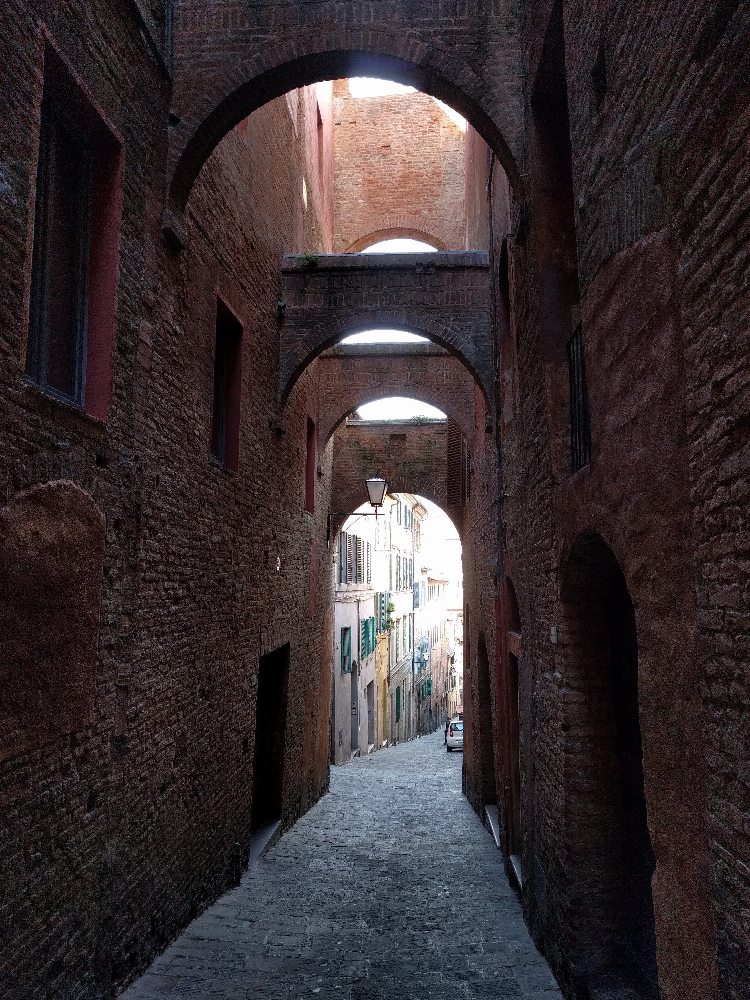
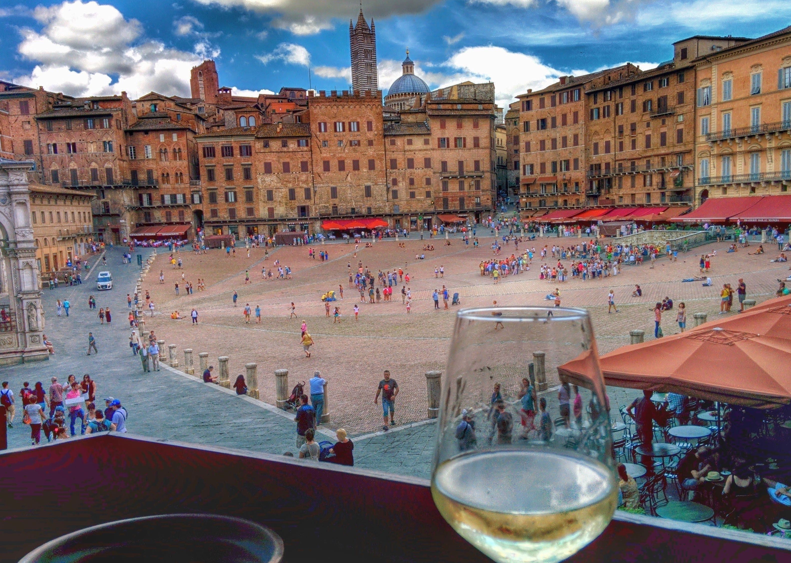

A collection of photos from my life in Tuscany.

#### Arno River from Ponte Vecchio⁩ (Florence⁩) - February 2019

#### Piazza Grande in Montepulciano⁩ - December 2018

#### Montepulciano⁩ - October 2018

#### Cortona⁩ - October 2018

#### Radda in Chianti - September 2018⁩

#### Lake of Chiusi⁩ - July 2017

#### Montepulciano⁩ - April 2017

#### ⁨Siena Cathedral⁩ - January 2017

#### Arno⁩ River (Florence⁩⁩) - November 2016

#### Palazzo Vecchio⁩ (Florence⁩⁩) - November 2016

#### Siena - October 2016

#### Florence⁩ - May 2016

#### Giotto's Campanile (Florence⁩) - October 2015⁩

#### Leaning Tower of Pisa (January 2015)

#### Piazza Salimbeni (December 2014)

#### Lake of Chiusi⁩ (2014)

#### Piazza Del Campo⁩ (Siena⁩ 2014)

#### San Domenico (Siena 2013)

