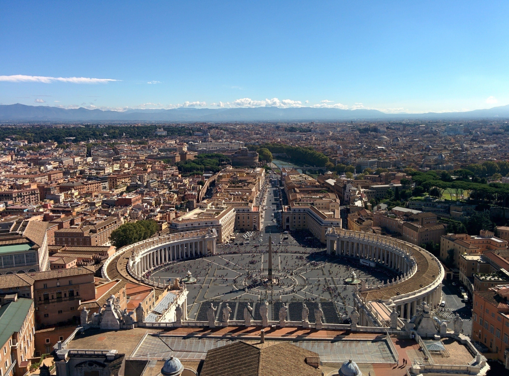
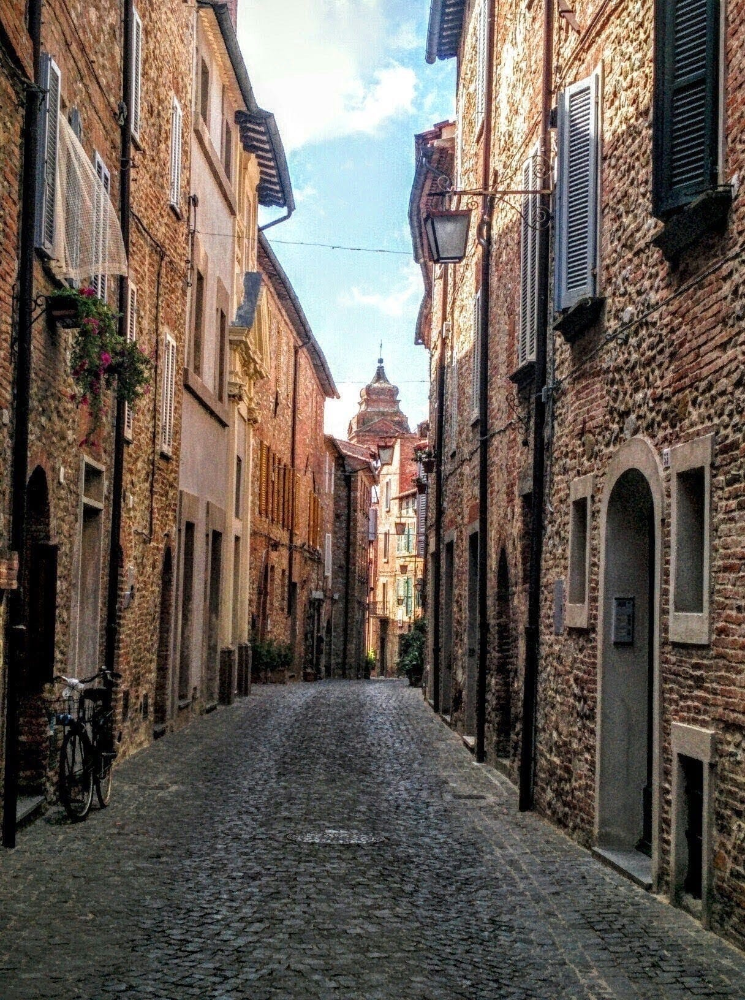

A collection of photos of my travels in central Italy.

#### Perugia - October 2019

#### Monteleone d'Orvieto⁩ - August 2019

#### Monteleone d'Orvieto⁩ - August 2019

#### Civita di Bagnoregio⁩ - March 2016

#### La Scarzuola - January 2016

### Colosseum⁩ - September 2015

### Saint Peter's Square⁩ (Vatican City⁩) - September 2015

### Saint Peter's Square⁩ (Vatican City⁩) - September 2015

### Sistine Chapel⁩ (Vatican City⁩) - September 2015

#### Castiglione del Lago⁩ - August 2015

#### Monteleone d'Orvieto⁩ - July 2015

#### Monteleone d'Orvieto⁩ - July 2015

### Altar of the Fatherland - January 2015⁩

