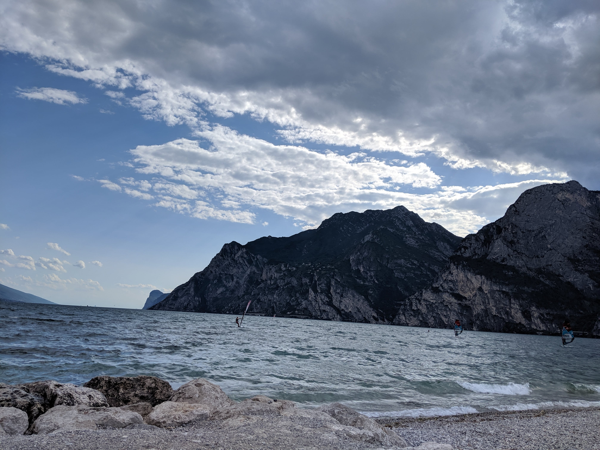
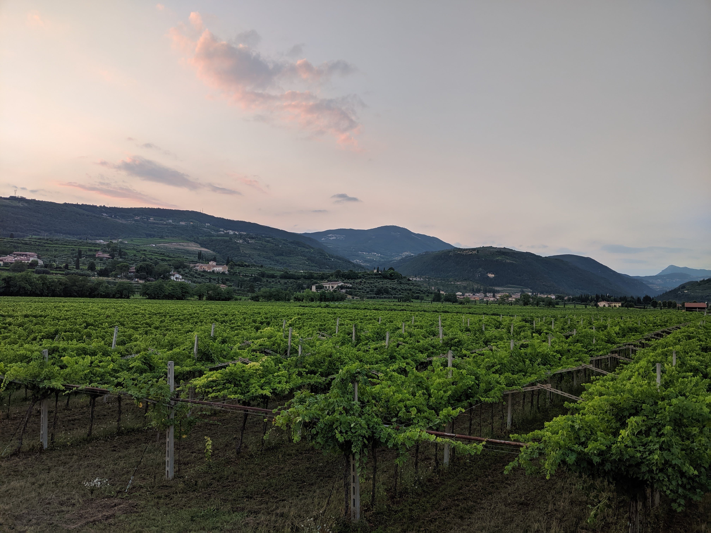

#### North shore of Lake Garda (⁨Italy⁩) - July 2019

#### Chioggia (⁨Italy⁩) - July 2019

#### Bure (⁨Italy⁩) - July 2019

#### Basilica of St. Anastasia (Verona) - May 2019

#### From Ponte Pietra (Verona) - May 2019

#### San Pietro in Cariano (⁨Italy⁩) - April 2019

#### Darsena (Sirmione) - March 2019

#### Scaligero Castel (Sirmione) - March 2019

